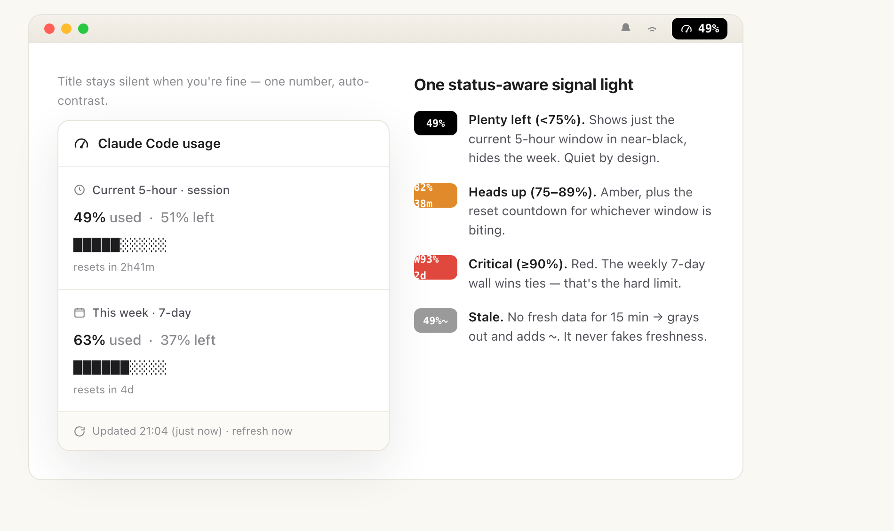

# ClaudeGauge

> A macOS menu bar gauge for your Claude Code usage — real-time, state-aware, and never lying with stale data.

[](LICENSE)


ClaudeGauge puts your Claude Code (Pro/Max) quota right in the menu bar. It shows how much of your rolling 5-hour and weekly limits you've burned — using the exact same numbers as Claude Code's `/usage` — stays quiet when you have headroom, shouts when you don't, and heals expired auth tokens on its own so it keeps working even when you haven't touched Claude Code in a while.

[简体中文](README.zh-CN.md)



<sub>A quiet gauge sits in your menu bar. Click it for the full breakdown — current 5-hour session, weekly window, progress bars, and reset countdowns.</sub>

## Why ClaudeGauge?

**See where you stand at a glance — without ever opening the usage page.** Claude Code's limits are real, but checking them means stopping to run `/usage` or reopening [claude.ai's usage settings](https://claude.ai/settings/usage) over and over. ClaudeGauge keeps that number *always visible* in your menu bar, so you never have to break flow to find out how close you are to a wall.

**Safe and private — by design, not by promise.** A usage gauge has to read your account, so trust matters more than features. ClaudeGauge is built to earn it:

- It reads **only** your usage numbers — **never** your conversations, prompts, files, or code.
- Your auth token goes to **Anthropic's own endpoint and nowhere else** — no third-party servers, none of ours, zero telemetry.
- It's **fully open source and unobfuscated** — every line is plain bash/python you can read before you run it, and `uninstall.sh` leaves no trace and never touches your credentials.

**Smart where it counts** — a few touches that make it pleasant to live with:

- 🩹 **Self-healing** — keeps working even after hours of idle by quietly renewing the expired auth token for you, so you never see a dead gauge.
- 🚦 **Rate-limit-safe** — polls adaptively: barely at all when you have headroom, faster as a limit closes in.
- 🤥 **Never lies** — if the data goes stale it grays out and says so, instead of showing a comforting wrong number.
- 🔔 **Heads-up** — a native macOS notification when you cross 75% or 90%, so a wall never sneaks up on you.
- 📐 **Notch-proof** — stays narrow enough that the MacBook notch can never swallow it.

## Features

- **State-aware minimalist display** — One signal light, not a wall of numbers. When you have headroom, ClaudeGauge shows just your current 5-hour usage in near-black, adaptive text and hides the rest. Only when a window actually starts biting does it surface that window, color it orange or red, and add a reset countdown. If both windows are in trouble it shows the more severe one — and a truly urgent weekly window (the 7-day hard wall) always wins.
- **Real-time & self-healing** — A background refresher polls the same usage endpoint Claude Code uses, throttling adaptively to avoid rate limits. Its key trick: when your keychain OAuth token is about to expire, it runs a single cheap headless `claude -p` from `/tmp` to make Claude Code renew the token — so the gauge keeps updating even after long idle periods, no manual login required.
- **Honest staleness** — If data hasn't refreshed in over 15 minutes, the menu bar goes gray with a `~` suffix and the dropdown warns you. ClaudeGauge would rather tell you it doesn't know than show you a comforting but wrong number.
- **Privacy-first** — Reads only your OAuth token from the keychain and calls only Anthropic's usage endpoint. It never reads your `~/.claude/projects` conversations or code, has no telemetry, and is plain readable bash/python with no obfuscation.
- **Notch-friendly** — On Macs with a notch, the menu bar title is kept to ~90px (≈11 characters) at all times. Go wider than that and the notch swallows your title whole — so ClaudeGauge never does.

## Requirements

- macOS
- [SwiftBar](https://github.com/swiftbar/SwiftBar) — installed automatically via Homebrew if missing (`brew install --cask swiftbar`)
- A logged-in [Claude Code](https://claude.com/claude-code) — provides both the OAuth token and the `claude` CLI used for token renewal
- A Claude **Pro or Max** subscription
- System `python3` (ships with macOS)

## Install

```bash
git clone https://github.com/EarthOnlineDev/claude-gauge.git
cd claude-gauge
./install.sh
```

The installer will:

1. Install SwiftBar via Homebrew if it isn't already present
2. Drop the renderer into your SwiftBar plugin directory and the refresher + bridge into `~/.claude`
3. Register a background LaunchAgent (`dev.earthonline.claude-gauge`) that refreshes every 30 seconds
4. Pull your usage once so the gauge appears immediately

A usage percentage should appear in the top-right of your menu bar within a few seconds.

### Optional: real-time statusLine enhancement

ClaudeGauge already updates on its own every minute or so. But you can make the menu bar update *instantly* while you're actively using Claude Code — with zero API calls and zero cost — by wiring up the optional statusLine bridge.

Add this to `~/.claude/settings.json` (if you already have a `statusLine`, merge it manually):

```json
"statusLine": {
  "type": "command",
  "command": "~/.claude/claude-gauge-statusline.py"
}
```

This bridge reads the rate-limit numbers Claude Code already hands its status line and writes them to a local cache the menu bar picks up. It only affects sessions started *after* you add it.

## How it works

ClaudeGauge is three small, independent layers writing to and reading from `~/.cache/claude-gauge/`.

1. **Render layer** — `plugin/claude-gauge.15s.sh`. SwiftBar runs this every 15 seconds. It reads whichever of `live.json` (instant, from the bridge) and `cache.json` (from the refresher) is newer, then renders the state-aware title and the detailed dropdown. As a fallback, if the background data is stale, it can fetch usage itself.
2. **Data layer** — `refresher/claude-gauge-refresh.sh`. Triggered by the LaunchAgent every 30 seconds, it decides adaptively whether to actually poll: every 45s when urgent, 60s when you need attention or are active, and 240s when you have headroom and are idle (to stay clear of HTTP 429). It authenticates with the OAuth token from the `Claude Code-credentials` keychain entry, calls `https://api.anthropic.com/api/oauth/usage`, atomically writes `cache.json`, and fires a macOS notification when you cross the 75% or 90% threshold (once per window per cycle). It's also where token self-healing happens: when the token is under ~20 minutes from expiry, it runs `claude -p ok` from `/tmp` to make Claude Code refresh it.
3. **Bridge layer (optional)** — `bridge/claude-gauge-statusline.py`. Used as a Claude Code `statusLine` command, it reads the `five_hour` / `seven_day` rate limits (used percentage + reset time) straight from the status-line JSON and writes them to `live.json` — giving the menu bar instant, free updates while you work.

**Data flow:** the refresher (and the optional bridge) write usage snapshots into `~/.cache/claude-gauge/`; the SwiftBar plugin reads the freshest snapshot and renders it. The layers never call each other directly — they communicate only through those JSON files, so any one of them can fail without breaking the others.

## Privacy & Security

ClaudeGauge is deliberately small and inspectable:

- **Reads only** the OAuth token from the macOS keychain (`Claude Code-credentials`) and calls **only** the Anthropic usage endpoint (`api.anthropic.com/api/oauth/usage`).
- **Never** reads your `~/.claude/projects` conversations, prompts, or code.
- **No telemetry, no third parties.** Your token is sent to Anthropic and nowhere else.
- **No obfuscation.** Every line is readable bash and python you can audit before running.

## Uninstall

```bash
./uninstall.sh
```

This unloads the LaunchAgent, removes the plugin, refresher, bridge, and the `~/.cache/claude-gauge` cache. It does **not** touch your Claude Code credentials or any of your data. If you added the optional `statusLine`, remove it from `~/.claude/settings.json` yourself.

## FAQ

**Why is the number slightly different from the official `/usage`?**
It shouldn't be by much — ClaudeGauge calls the exact same endpoint Claude Code's `/usage` uses. Small gaps come from timing: the gauge shows the last snapshot it pulled, which may be a little behind a refresh you just triggered. Click "Refresh now" in the dropdown to force the latest.

**Why does the menu bar sometimes go gray with a `~`?**
That's the honest-staleness signal: the data is more than 15 minutes old (usually because Claude Code has been idle or the API was rate-limited). Use Claude Code for a moment, or hit "Refresh now," and it returns to normal.

**Will this eat into my quota?**
Effectively no. Reading usage is a lightweight metadata call, throttled down to once every 4 minutes when you're idle. The only thing that touches your subscription is the occasional self-healing `claude -p ok` — a single one-token prompt run only when your auth token is about to expire.

**Which plans are supported?**
Claude **Pro** and **Max** subscriptions, which expose the 5-hour and weekly usage windows.

## Contributing

Issues and pull requests are welcome. See [docs/](./docs/) for screenshots and additional notes. ClaudeGauge is released under the [MIT License](LICENSE) by [EarthOnline](https://github.com/EarthOnlineDev).
