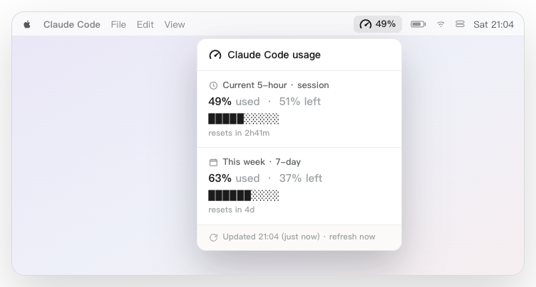
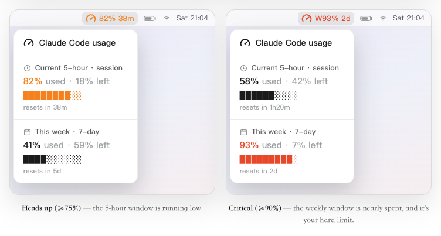
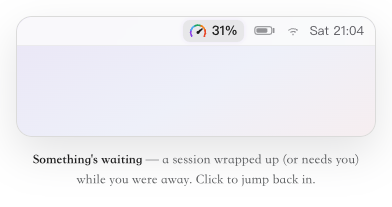

<p align="center">
  <picture>
    <source media="(prefers-color-scheme: dark)" srcset="docs/logo-dark.png">
    
  </picture>
</p>

# ClaudeGauge

> Your Claude Code usage, right in the menu bar — a glance is all it takes.

[](LICENSE)


[简体中文](README.zh-CN.md)



When you're deep in Claude Code, the same question keeps nagging: *how much of my 5-hour limit is left? Am I about to hit the weekly wall?* Finding out means stopping to run `/usage` or open the [claude.ai usage page](https://claude.ai/settings/usage). ClaudeGauge keeps that number in the top-right of your menu bar, so you never have to break flow to check.

## One number, three colors

The whole tool is a single percentage that changes color as a limit gets closer. You don't read it — you just notice it:

- **Black** — plenty left. It stays quiet and out of the way.
- **Orange** — getting low (75%+). It brings along a reset countdown, so you can decide whether to push on or wait.
- **Red** — nearly out (90%+).

Click it for the full breakdown: your current 5-hour window and this week's window, each with a progress bar and a reset time. If the data goes stale, the number grays out — so you can always tell whether you're looking at something current.



<sub>Whichever window is about to bite is the one that surfaces — amber for the 5-hour session, red for the weekly wall — each with its reset countdown.</sub>

## Safe to leave running

A usage gauge has to read your account, so *how* it does that matters more than any feature:

- **Reads only your usage** — never your conversations, prompts, files, or code. Many usage trackers work by reading your `~/.claude/projects` conversation logs — down to the text of your prompts and replies; this one never opens those files.
- **Talks only to Anthropic** — your token goes to Anthropic's own usage endpoint and nowhere else: no third-party servers, none of ours, no analytics.
- **Open and auditable** — plain bash and python with no obfuscation; read it before you run it. Uninstalling removes everything and never touches your credentials.
- **Tiny** — a small menu-bar script plus a light background refresh. That's the whole thing.

## Install

**Option A — download the installer** (no terminal needed):

Download [ClaudeGauge.pkg](https://github.com/EarthOnlineLabs/claude-gauge/releases/latest/download/ClaudeGauge.pkg), double-click, done.

**Option B — terminal:**

```bash
git clone https://github.com/EarthOnlineLabs/claude-gauge.git
cd claude-gauge
./install.sh
```

The percentage appears in the top-right of your menu bar within a few seconds.

**Uninstall** — run `~/.claude/claude-gauge-uninstall.sh`. It cleans up completely and never touches your credentials.

> Requires macOS, a Claude **Pro or Max** subscription, and a logged-in [Claude Code](https://claude.com/claude-code). The menu-bar host [SwiftBar](https://github.com/swiftbar/SwiftBar) is installed for you if it's missing.

**Optional — live updates while you work.** Add one line to `~/.claude/settings.json` (merge it if you already have a `statusLine`):

```json
"statusLine": { "type": "command", "command": "~/.claude/claude-gauge-statusline.py" }
```

Now the menu bar updates instantly as you use Claude Code — all local, zero cost. It only affects sessions started after you add it. Without it, the background refresher still updates every minute or so.

## Completion alert — come back at the right moment

Kick off a long task and step away. When a Claude Code session **finishes** — or **pauses to ask for your permission** — the menu-bar gauge lights up in rainbow to wave you back. One click brings the Claude app to the front and clears the rainbow. The percentage keeps its usual color; only the icon turns rainbow, so a quota warning is never masked.

<p align="center"></p>

It's **on by default** — `./install.sh` sets it up for you. It reacts **only to Claude Code's own "finished" and "needs-permission" events** — it never reads your conversations or code, shows no pop-ups, and sends no telemetry. Setup safely merges its hooks into your `~/.claude/settings.json` (backed up first, idempotent, re-parsed for validity, and leaving any hooks you already have untouched), and `./uninstall.sh` removes only those entries again.

Prefer to toggle it on its own?

```bash
bash alert/install-alerts.sh               # (re-)enable
bash alert/install-alerts.sh --uninstall   # disable
```

## How it works (for the curious)

ClaudeGauge is three small, independent pieces that talk only through files in `~/.cache/claude-gauge/`, so any one can fail without taking the others down:

- **Render** — a [SwiftBar](https://github.com/swiftbar/SwiftBar) plugin that draws the number and the dropdown.
- **Refresh** — a background job that fetches your usage from the same endpoint Claude Code's `/usage` uses, authenticating with the token Claude Code already keeps in your keychain. It **polls adaptively** — barely at all when you have headroom, faster as a limit approaches — to stay well clear of rate limits. It also **keeps itself alive at zero cost**: that token expires while Claude Code is idle, so when it's about to, the refresher renews it with a direct OAuth refresh — an auth call that costs nothing against your quota, never a prompt or an inference. The gauge never goes dead.
- **Bridge (optional)** — lets Claude Code hand its live usage numbers straight to the gauge, for the instant updates described above.

On a MacBook with a notch, the menu-bar text is always kept short enough that the notch can't swallow it.

For the full design — the layers, the display rules, and the data flow — see [docs/ARCHITECTURE.md](docs/ARCHITECTURE.md).

## Contributing

Issues and pull requests are welcome. ClaudeGauge is released under the [MIT License](LICENSE) by [EarthOnline Labs](https://github.com/EarthOnlineLabs).
