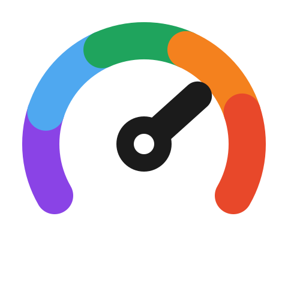
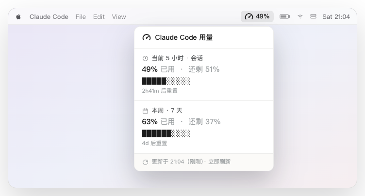
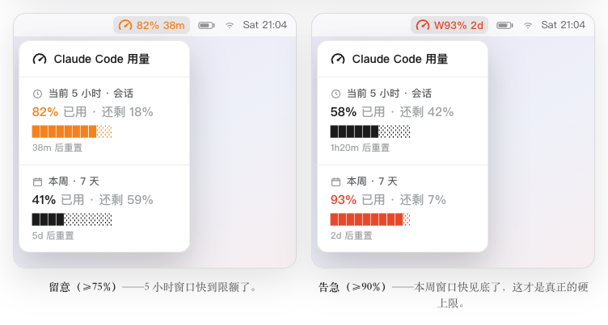
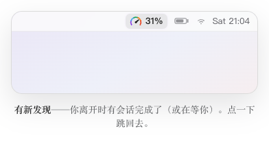

<div align="right">

[English](README.md) · **简体中文**

</div>

<p align="center">
  <picture>
    <source media="(prefers-color-scheme: dark)" srcset="docs/logo-dark.png">
    
  </picture>
</p>

# ClaudeGauge

> 把 Claude Code 的额度放进菜单栏，瞟一眼就知道还剩多少。

<p align="center">
  
</p>

用 Claude Code 的时候，心里总惦记着一件事：*这个 5 小时窗口还剩多少？这周会不会撞墙？* 想知道答案，每次都得停下来打开 `/usage`、或翻到 [claude.ai 的用量页](https://claude.ai/settings/usage)。ClaudeGauge 把这个数字常驻在菜单栏右上角，看一眼就够了——不打断手头的事。

## 一个数字，三种颜色

整个工具就是一个会变色的百分比。你不用去读它，扫一眼颜色就知道现在什么情况：

- **黑色** —— 还很宽裕，它安安静静待着，不打扰你。
- **橙色** —— 快不够了（已用 75% 以上），顺手把重置倒计时也带出来，方便你决定是接着干还是等一等。
- **红色** —— 见底了（已用 90% 以上）。

点开它，是完整明细：当前 5 小时窗口和这一周窗口，各自带进度条和重置时间。数据要是太久没刷新，这个数字会变灰——所以你一眼能分清，看到的是不是当下的。

<p align="center">
  
</p>

<p align="center"><sub>哪个窗口快咬你，哪个就冒出来——5 小时会话变橙，一周硬墙变红，各带重置倒计时。</sub></p>

## 放心挂着跑

一个用量工具必须读你的账号，所以它**怎么读**，比有多少功能更要紧：

- **只看额度** —— 绝不碰你的对话、提示词、文件和代码。不少用量工具是靠读你 `~/.claude/projects` 里的对话记录来统计的，连 prompt 和回复的原文都在内；它从不打开那些文件。
- **只跟 Anthropic 说话** —— token 只发往 Anthropic 官方的用量接口，别无他处：没有第三方服务器，没有我们自己的服务器，不收集任何数据。
- **开源、能审** —— 全是没有混淆的 bash 和 python，装之前你可以自己读一遍。卸载脚本清得干干净净，绝不动你的凭证。
- **极轻** —— 一个菜单栏小脚本，加一个后台轻量刷新，就这些。

## 安装

```bash
git clone https://github.com/EarthOnlineLabs/claude-gauge.git
cd claude-gauge
./install.sh
```

几秒后菜单栏右上角就会出现用量百分比。不想要了：`./uninstall.sh`，清得干净，且不碰你的凭证。

> 需要 macOS、Claude **Pro 或 Max** 订阅、以及已登录的 [Claude Code](https://claude.com/claude-code)。菜单栏宿主 [SwiftBar](https://github.com/swiftbar/SwiftBar) 要是没装，脚本会帮你装上。

**可选 —— 用 Claude Code 时实时刷新。** 在 `~/.claude/settings.json` 里加一行（已有 `statusLine` 就自己合并一下）：

```json
"statusLine": { "type": "command", "command": "~/.claude/claude-gauge-statusline.py" }
```

加上之后，你一边用 Claude Code，菜单栏就一边实时跟着变——纯本地、零成本。它只对配置之后新开的会话生效；不加也行，后台每分钟左右会自动更新。

## 完成提醒 ·「有新发现」

把长任务丢给它，自己去忙别的。当某个 Claude Code 会话**完成**、或**停下来等你授权**时，菜单栏的表盘会亮起彩虹，把你叫回来。点一下就把 Claude 桌面 App 拉回前台，彩虹随即熄灭。百分比照常保持原来的颜色，只有图标变彩虹——额度告急不会被盖住。

<p align="center"></p>

它**默认就开**——`./install.sh` 会帮你装好。它**只对 Claude Code 自己的「完成」「等授权」事件作反应**——绝不读你的对话或代码，不弹窗，也不收集任何数据。安装时会把它的 hook 安全地合并进你的 `~/.claude/settings.json`（先备份、幂等、回解析校验，且绝不动你已有的 hooks）；`./uninstall.sh` 也会把这些条目原样撤掉。

想单独开关它：

```bash
bash alert/install-alerts.sh               # 重新开启
bash alert/install-alerts.sh --uninstall   # 关闭
```

## 工作原理

ClaudeGauge 拆成三个互不依赖的小块，只通过 `~/.cache/claude-gauge/` 下的文件交流，任何一块出问题都不会拖垮其它：

- **渲染** —— 一个 [SwiftBar](https://github.com/swiftbar/SwiftBar) 插件，把那个数字和下拉明细画到菜单栏。
- **刷新** —— 一个后台任务，从 Claude Code `/usage` 同源的接口取你的用量，用 Claude Code 已经存在钥匙串里的 token 鉴权。它**自适应节流**：宽裕时几乎不打扰接口，临近限额才加快，离限流远远的。它还能**零成本自己续命**：Claude Code 闲置时那个 token 会过期，刷新器在它快过期时用一次直接的 OAuth 刷新把它续上——一次不计入任何额度的鉴权调用，绝不发提示、不做推理，表盘从不「罢工」。
- **桥接（可选）** —— 让 Claude Code 把实时用量直接喂给工具，也就是上面说的「实时刷新」。

带刘海的 Mac 上，菜单栏文字始终压得够短，刘海吞不掉它。

想再深入——分层、显示规则、数据流——看 [架构文档](docs/ARCHITECTURE.md)。

## 许可证

[MIT](LICENSE) © [EarthOnline](https://github.com/EarthOnlineLabs)
